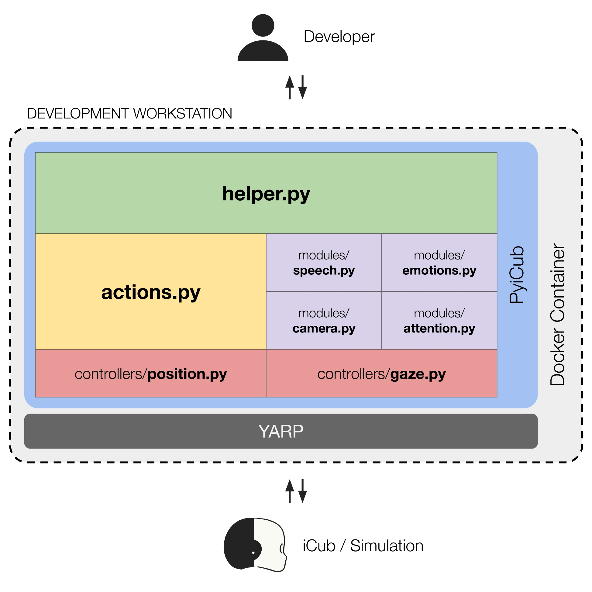

System Architecture
===================

The system architecture of PyiCub is designed to simplify the control of the iCub robot by providing intuitive, high-level Python interfaces.
Here's a summary of its key components and their functions:

* **Helper Module** (``helper.py``):
    This module serves as the primary entry point to PyiCub's functionalities. It offers a high-level Python interface, abstracting the complexity of the underlying YARP middleware. Through this module, users gain intuitive control over motors, gaze, cameras, speech, facial expressions, and both predefined and custom robot actions via a unified, object-oriented interface. The ``iCub`` class, implemented as a singleton, is at its core, orchestrating critical subsystems like position and gaze controllers, action management, and monitoring tools.

* **Action Module** (``actions.py``):
    This module is responsible for the creation and execution of high-level robot behaviors, referred to as "actions". These actions can involve coordinated movements of multiple robot parts, precise gaze shifts, predefined eye configurations, and can integrate user-defined operations in structured sequences. Complex behaviors are defined using ``iCubFullbodyAction`` objects, composed of sequential ``iCubFullbodyStep`` elements, which can include limb motions, gaze actions, and custom Python calls.

* **Perception and Interaction Modules** (``modules/*.py``):
    These modules enhance the iCub's interactive capabilities by enabling it to perceive and respond naturally to humans and its environment. They include components for functionalities such as speech recognition, emotion modeling, attention tracking, and camera perception.

* **Controllers** (``controllers/*.py``):
    PyiCub incorporates dedicated controllers that process commands from the Helper Module through the primary ``iCub`` class.

    * **PositionController**: Manages joint-level motions for body parts like arms, legs, and torso. It supports time- and speed-based movements, encoder feedback, and motion completion checks.
    * **GazeController**: Coordinates eye and neck movements through high-level methods, allowing for configurable trajectory parameters and selective control of degrees of freedom.
    * Both controller types leverage YARP drivers to maintain communication with either the physical iCub robot or simulation environments, abstracting hardware complexity with consistent interfaces.

* **Communication Layer**:
    This layer interfaces seamlessly with the Yet Another Robot Platform (YARP) middleware, ensuring reliable connectivity with the physical or simulated iCub robot. YARP is the existing software ecosystem for the iCub robot.

* **Hierarchical Structure and Deployment**:
    The system architecture is organized in a hierarchical top-down structure, where each ascending level represents increasing degrees of abstraction between the user and the robot. For deployment, essential software for operating the robot, including YARP, iCub core modules, and PyiCub, runs on the development workstation, typically deployed as a Docker container. This containerization ensures a consistent and hardware-independent runtime environment, minimizing setup complexity and dependency issues.
